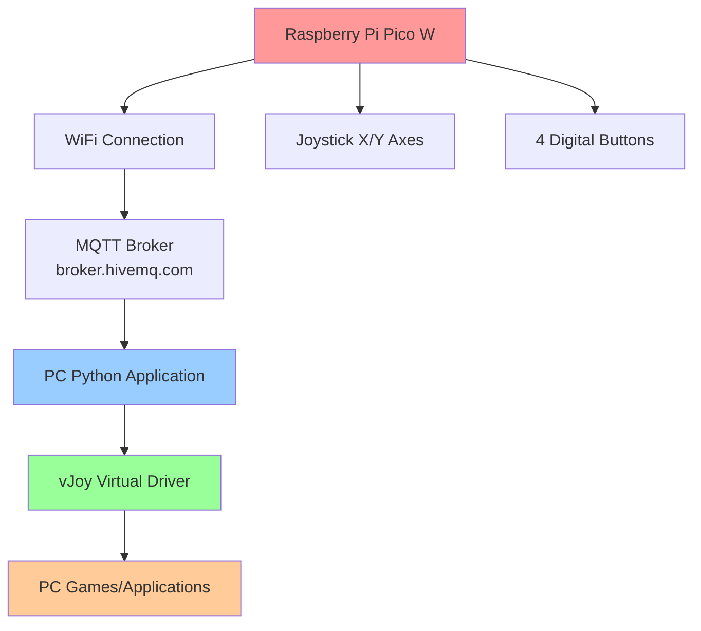

# 🕹️ Wireless Joystick Controller for PC

**Simulation-Joystick-Controller-for-PC** - Embedded Systems Project 2025

Wireless joystick controller system using Raspberry Pi Pico W with MQTT communication for seamless PC gaming control.

## 👥 Team Members
- **Emrah Žunić**
- **Mirnes Fehrić** 
- **Kerim Šikalo**
- **Faris Aljić**

## 📺 Demo Video
🎥 [Watch the project demonstration](https://www.youtube.com/watch?v=PyYIeGLBYZM)

## 🎯 Project Overview

This project implements a wireless joystick controller that transforms a Raspberry Pi Pico W into a fully functional PC game controller. The system provides precise 360-degree analog control with 4 additional action buttons, communicating wirelessly via MQTT protocol.

### ✨ Key Features

- **🎮 360-degree analog movement** - Full analog control in all directions
- **📡 Wireless communication** - MQTT over WiFi with minimal latency
- **🔘 4 action buttons** - Toggle-based button functionality
- **⚙️ Automatic calibration** - Built-in joystick center calibration
- **🎯 Deadzone support** - Eliminates unwanted drift (configurable 10% deadzone)
- **🎲 Game compatibility** - Works with any PC game supporting joystick input
- **⚡ Low latency** - Optimized 5Hz update rate for responsive gaming

## 🔧 Hardware Components

| Component | Model | Function |
|-----------|-------|----------|
| **Microcontroller** | Raspberry Pi Pico W | Main processing unit with WiFi |
| **Joystick** | Analog X/Y joystick module | 360-degree movement input |
| **Buttons** | 4x tactile switches | Additional game controls |
| **Power** | USB | 5V power supply |

### 📋 Pin Configuration

| Pin | Component | Type | Description |
|-----|-----------|------|-------------|
| GP28 | X Axis | Analog Input | Horizontal joystick position (ADC) |
| GP27 | Y Axis | Analog Input | Vertical joystick position (ADC) |
| GP0 | Left Indicator | Digital Input | Left turn signal button |
| GP1 | Right Indicator | Digital Input | Right turn signal button |
| GP2 | Horn/Sirena | Digital Input | Horn/siren activation |
| GP3 | Wipers | Digital Input | Windshield wiper control |

## 🏗️ System Architecture



## 💻 Software Stack

### Embedded Side (Pico W)
- **MicroPython** - Main firmware
- **umqtt.simple** - MQTT client library
- **machine** - Hardware abstraction layer

### PC Side  
- **Python 3.7+** - Main application runtime
- **paho-mqtt** - MQTT client library
- **pyvjoy** - vJoy virtual joystick interface
- **vJoy Driver** - Windows virtual joystick driver

## 🚀 Installation & Setup

### Prerequisites
- Windows 10/11
- Python 3.7 or higher
- Raspberry Pi Pico W
- Thonny IDE (recommended)

### Step 1: Install vJoy Driver
> ⚠️ **IMPORTANT**: Install vJoy driver first before running Python application!

1. Download from [vJoy official website](http://vjoystick.sourceforge.net/)
2. Run installer as administrator
3. Restart your computer
4. Verify installation in Control Panel → Devices and Printers

### Step 2: Configure vJoy
1. Open "Configure vJoy" from Start menu
2. Select Device 1
3. Enable X Axis, Y Axis, and minimum 4 buttons
4. Click "Apply"

### Step 3: Install Python Dependencies
```bash
pip install paho-mqtt
pip install pyvjoy
```

### Step 4: Setup Raspberry Pi Pico W
1. Flash MicroPython firmware to Pico W
2. Connect hardware components according to pin configuration
3. Open `thonny.py` in Thonny IDE
4. Update WiFi credentials:
```python
SSID = "YourWiFiNetwork"
PASSWORD = "YourPassword"
```
5. Save as `main.py` to Pico W

## 🎮 Usage

### Starting the System

1. **Start Pico W Application:**
   - Connect Pico W via USB
   - Should automatically connect to WiFi and MQTT broker
   - Console output should show: `MQTT klijent povezan.`

2. **Start PC Application:**
   ```bash
   python skripta.py
   ```
   - Successful connection shows: `Spojen na MQTT broker.`

### Testing the Controller

1. Go to Control Panel → Game Controllers
2. Right-click "vJoy Device" → Properties  
3. Test joystick movement and button presses

### Game Integration

1. In your game: Settings → Controls
2. Select "vJoy Device" as controller
3. Map controls as needed:
   - **X Axis** → Steering/Horizontal movement
   - **Y Axis** → Throttle/Vertical movement  
   - **Button 1** → Left indicator
   - **Button 2** → Right indicator
   - **Button 3** → Horn/Siren
   - **Button 4** → Wipers

## ⚙️ Configuration

### Deadzone Adjustment
Modify in `skripta.py`:
```python
DEADZONE_PERCENT = 0.10  # Default 10%
# 0.05 - More sensitivity
# 0.15 - Less sensitivity  
```

### Update Rate
Modify in `thonny.py`:
```python
time.sleep(0.2)  # 5 Hz (default)
time.sleep(0.1)  # 10 Hz (faster)
time.sleep(0.5)  # 2 Hz (slower)
```

## 🔧 Troubleshooting

### Common Issues

**vJoy Device Not Found:**
- Ensure vJoy is properly installed and configured
- Run Python application as administrator
- Restart computer if necessary

**WiFi Connection Failed:**
- Check SSID/password accuracy
- Ensure 2.4GHz network (Pico W doesn't support 5GHz)
- Verify signal strength

**MQTT Connection Issues:**
- Check internet connection
- Try alternative broker: `test.mosquitto.org`
- Temporarily disable Windows Firewall

**Joystick Drift:**
- Increase deadzone percentage
- Check cable connections
- Consider replacing joystick module

## 📊 Performance Specifications

- **Update Rate:** 5Hz (200ms intervals)
- **Total System Latency:** 15-60ms
  - ADC Sampling: ~1μs
  - WiFi Transmission: 10-50ms  
  - MQTT Processing: 1-5ms
  - PC Application: ~1ms
  - vJoy Driver: ~1ms
- **Resolution:** 16-bit ADC (0-65535 range)
- **Deadzone:** 10% around center position

## 🔬 Technical Details

### MQTT Protocol
- **Broker:** broker.hivemq.com
- **Port:** 1883 (non-TLS)
- **Topics:**
  - `tema/x` - X axis values (0-65535)
  - `tema/y` - Y axis values (0-65535)  
  - `tema/lijevo` - Left button state (0/1)
  - `tema/desno` - Right button state (0/1)
  - `tema/sirena` - Horn button state (0/1)
  - `tema/brisac` - Wiper button state (0/1)

### Data Processing
- Input range: 0-65535 (16-bit ADC)
- Output range: 0-32768 (vJoy format)
- Deadzone algorithm eliminates center drift
- Toggle-based button logic for state persistence

## 📁 Repository Structure

```
joystick-controller/
├── thonny.py              # Pico W firmware (MicroPython)
├── skripta.py             # PC application (Python)
├── docs/
│   ├── Specifikacija projekta.pdf
│   ├── Dokumentacija implementacije.pdf
│   ├── Korisnicka uputstva.pdf
│   └── Sema spajanja.pdf
├── README.md
└── LICENSE
```

## 🛠️ Adding New Functionality

### Adding New Button

**On Pico W (`thonny.py`):**
```python
button_new = Pin(4, Pin.IN, Pin.PULL_UP)
MQTT_TOPIC_NEW = b"tema/new"
# Add to main loop:
check_button_press(button_new, "new", MQTT_TOPIC_NEW, client)
```

**On PC (`skripta.py`):**
```python
elif msg.topic == "tema/new":
    button_value = int(payload_str)
    vj.set_button(5, button_value == 1)
```

## 📜 License

This project is open source. Feel free to use, modify, and distribute according to your needs.

## 🤝 Contributing

We welcome contributions! Please feel free to submit pull requests or open issues for bugs and feature requests.


---

*Developed as part of Embedded Systems course 2025*
